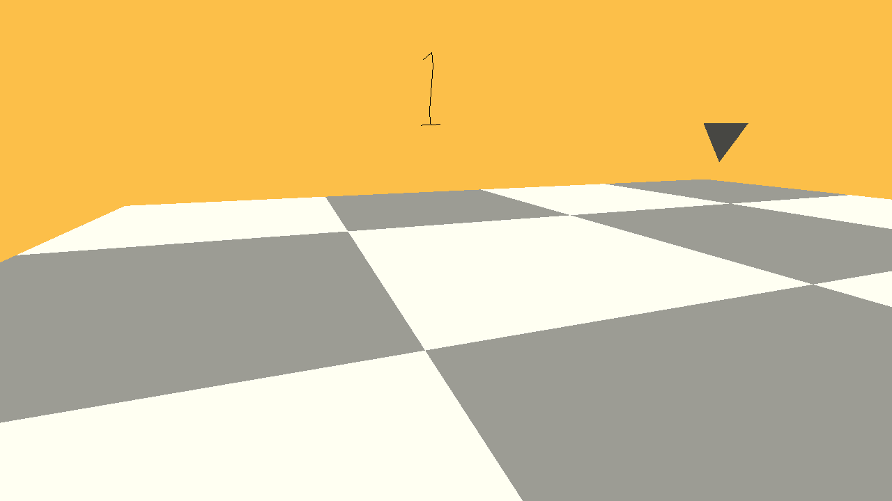

# Walking Minesweeper

Author: Weisheng Li

Design: It's basically a minesweeper game, but you have to walk on the checker board. Try to find a path to the destination without detonating any mines.
Screen Shot:

How To Play:

Regular first person control (WASD + mouse). The number on the screen has the exact same meaning as minsweeper: the number of mines in your neighbor cells.

Sources: N/A

This game was built with [NEST](NEST.md).

